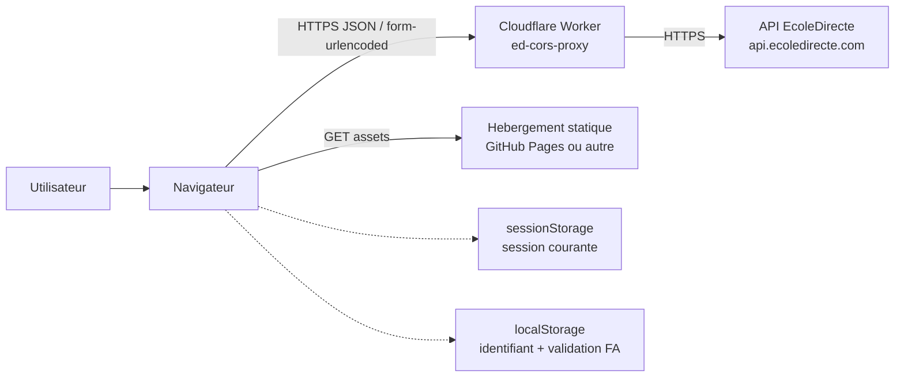
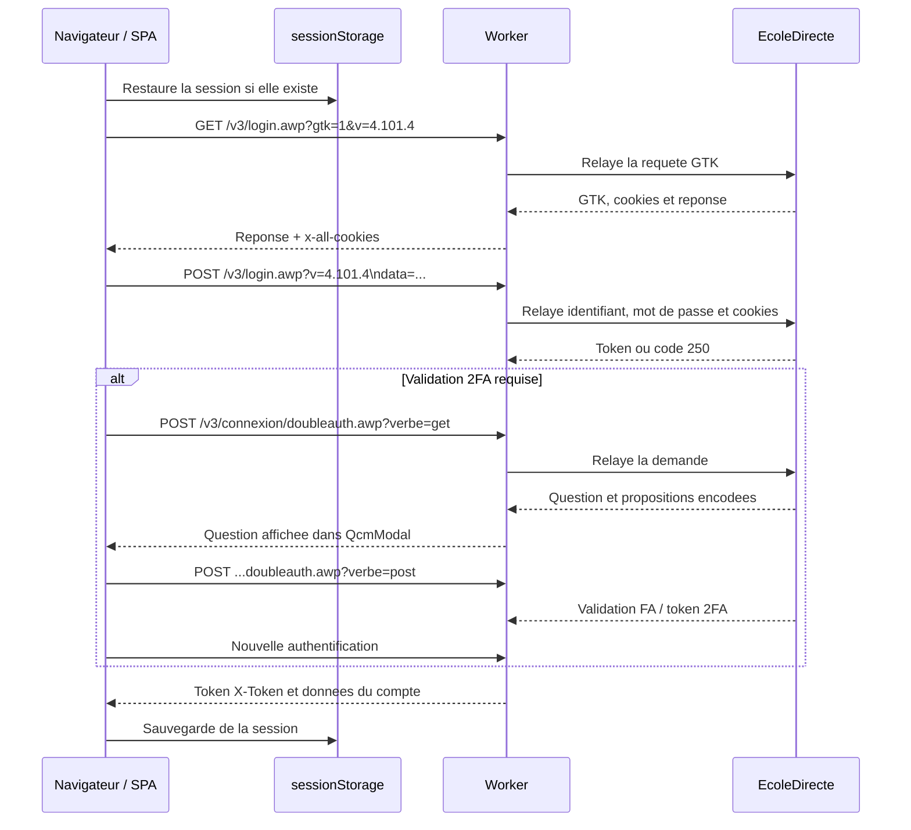

# Architecture d'infrastructure

## 1. Perimetre et etat actuel

`ed-homework` est une SPA React 100 % cote client, construite avec Vite et hebergeable comme site statique. L'application fonctionne avec un relais Cloudflare Worker deploye a l'adresse suivante :

```text
https://ed-cors-proxy.herve-proeschel.workers.dev
```

Le navigateur n'appelle pas directement l'API privee d'EcoleDirecte. Le client `src/services/edClient.js` appelle le Worker, qui relaie les requetes vers `https://api.ecoledirecte.com`.

Le Worker est present dans `cloudflare.js`. Son deploiement est manuel et declenche par le workflow GitHub Actions `Deploy Cloudflare Worker`; il n'y a pas de deploiement automatique a chaque push dans ce workflow.

## 2. Architecture implementee



| Composant | Responsabilite actuelle |
| --- | --- |
| SPA React | Afficher la connexion, le parcours MFA, la selection d'un eleve, les devoirs et l'impression. |
| `EdClient` | Maintenir les tokens et cookies necessaires, construire les requetes EcoleDirecte et decoder les reponses. |
| `sessionStorage` | Conserver la session active, le profil selectionne, la liste des eleves et le nom affiche. |
| `localStorage` | Conserver l'identifiant saisi et la validation FA retournee par le parcours 2FA. |
| Cloudflare Worker | Ajouter les en-tetes attendus par EcoleDirecte, transmettre le corps et exposer les en-tetes de session au navigateur. |
| EcoleDirecte | Authentifier l'utilisateur et fournir les comptes, le cahier de texte et ses details. |
| Service worker | Mettre en cache le shell et les assets de la SPA en production; les requetes API restent reseau. |

Le Worker ne contient pas de base de donnees et ne persiste pas la session. Les tokens, cookies et identifiants sont geres par le navigateur et transmis au Worker pendant les appels.

## 3. Flux applicatif

### 3.1 Initialisation et authentification



`EdClient` utilise la version d'API `4.101.4` dans la query string. Les requetes sont envoyees en `application/x-www-form-urlencoded` avec un champ `data` contenant le JSON du payload. Les appels authentifies transmettent `X-Token`; le flux de connexion peut aussi transmettre `x-gtk`, `x-cookies` et `2fa-token`.

### 3.2 Selection et recuperation des devoirs

Apres la connexion, les profils eleves sont extraits de la reponse du compte. `useEleveSelection` affiche `EleveModal` et conserve l'identifiant choisi. L'application appelle ensuite, pour les dates futures uniquement :

```text
POST /v3/Eleves/{eleveId}/cahierdetexte.awp?verbe=get
POST /v3/Eleves/{eleveId}/cahierdetexte/{date}.awp?verbe=get
```

Les details sont accumules dans `printDays`. Les contenus de devoirs encodes en Base64 sont decodes avant affichage dans `HomeWorkView`. Les reponses signalant une session expiree declenchent une nouvelle authentification si le mot de passe est encore present en memoire; sinon la session locale est supprimee et l'utilisateur doit se reconnecter.

### 3.3 Impression

`HomeWorkView` rend les devoirs dans `#printView`. Le bouton d'impression appelle `window.print()`. Les regles `@media print` masquent l'interface et formatent les jours et les matieres pour une sortie papier ou PDF. L'evenement `afterprint` remet a jour le message d'etat.

## 4. Worker Cloudflare actuel

Le Worker de `cloudflare.js` est un relais HTTP generique :

1. Il repond aux preflights `OPTIONS`.
2. Il construit l'URL amont avec le chemin et la query string recus.
3. Il force les en-tetes `Host`, `Origin`, `Referer`, `Accept` et `User-Agent` attendus par EcoleDirecte.
4. Il reconstitue `Cookie` depuis `x-cookies` et `x-gtk`.
5. Il relaie `2fa-token` et le corps de la requete.
6. Il recopie la reponse et expose `X-Token`, `2fa-token`, `x-all-cookies` et `x-gtk` au navigateur.

Les cookies `Set-Cookie` retournes par EcoleDirecte sont reduits aux paires nom-valeur puis renvoyes dans `x-all-cookies`, afin que `EdClient` puisse les conserver hors du mecanisme de cookies du navigateur.

Le Worker limite le CORS aux origines de `ALLOWED_ORIGINS`, aux methodes et routes utilisees par l'application, et aux parametres de query attendus. `ALLOWED_ORIGINS` est injectee par le workflow depuis le secret de l'environnement GitHub `cloudflare-production`; aucune valeur par defaut n'est acceptee. Les corps sont limites a 64 KiB et l'appel vers l'amont a 10 secondes.

## 5. Stockage et securite

### Donnees conservees dans le navigateur

* `sessionStorage.ed_session` contient le token actif, le token 2FA, GTK, les cookies reduits, l'eleve choisi, la liste des eleves et le nom affiche.
* `localStorage.ed_user` contient uniquement l'identifiant pour pre-remplir le formulaire.
* `localStorage.ed_fa` contient la reponse FA memorisee par le parcours MFA.
* Le mot de passe est conserve uniquement dans l'etat React pendant la session de la page; il n'est pas ecrit dans le stockage local.

La deconnexion et l'expiration de session recreent `EdClient`, effacent la session et retirent les donnees d'authentification de `sessionStorage`. Le service worker ne met pas en cache les appels API ni les reponses privees.

### Limites et configuration de production

Les tentatives de connexion sont limitees a 5 par minute et par adresse IP, et les validations 2FA a 5 par 10 minutes. Le Worker utilise les bindings Cloudflare `LOGIN_RATE_LIMITER` et `TWO_FA_RATE_LIMITER` lorsqu'ils sont configures; sinon un limiteur memoire local est utilise comme protection de secours, sans garantie distribuee.

Le Worker ne journalise pas les corps, tokens, cookies ou mots de passe. Les reponses d'erreur sont generiques. Ajouter le secret d'environnement `ALLOWED_ORIGINS` avec les origines exactes autorisees et activer les deux bindings de rate limiting avant une exposition publique.

## 6. Developpement et deploiement

### Frontend

```bash
npm install
npm run dev
npm run lint
npm test
npm run build
```

Le fichier `vite.config.js` gere la base de deploiement et genere le service worker `dist/sw.js` pendant le build. Aucun proxy Vite vers EcoleDirecte n'est configure dans la version actuelle : le frontend utilise le Worker configure en dur dans `src/services/edClient.js`, en developpement comme en production.

### Worker

Le workflow `.github/workflows/deploy-worker.yml` est manuel et utilise `cloudflare/wrangler-action@v3` avec la commande :

```text
wrangler deploy cloudflare.js --name ed-cors-proxy
```

Il attend les secrets d'environnement GitHub `cloudflare-production` : `CLOUDFLARE_API_TOKEN` et `CLOUDFLARE_ACCOUNT_ID`. Le token Cloudflare ne doit jamais etre place dans le depot ni dans le bundle frontend.

## 7. Verification avant publication

- [ ] `npm run lint` passe.
- [ ] `npm test` passe.
- [ ] `npm run build` genere le bundle et `dist/sw.js`.
- [ ] Le Worker repond au preflight et expose les headers necessaires.
- [ ] Login standard, MFA, selection d'un eleve et recuperation des devoirs fonctionnent avec un compte de test.
- [ ] L'expiration de session efface bien le stockage de session.
- [ ] L'impression fonctionne en navigateur et en export PDF.
- [ ] `ALLOWED_ORIGINS` contient uniquement les origines attendues.
- [ ] Les bindings `LOGIN_RATE_LIMITER` et `TWO_FA_RATE_LIMITER` sont actifs en production.
