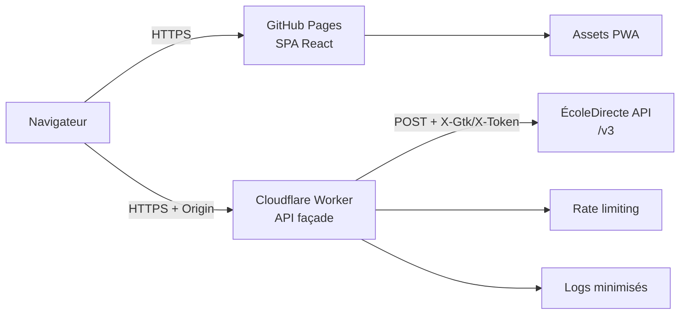
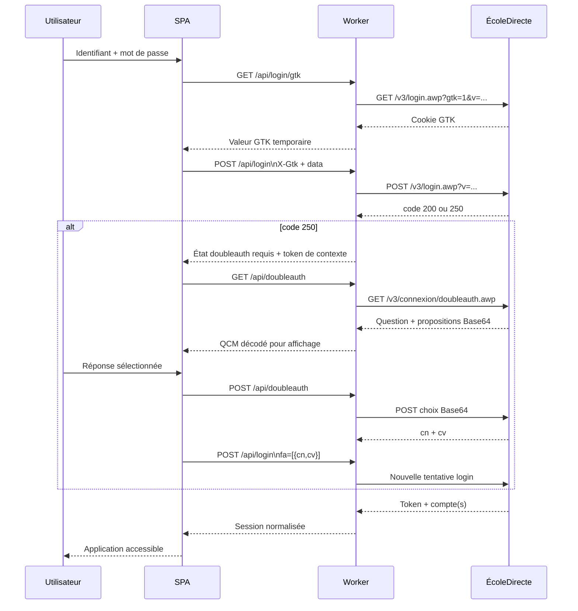
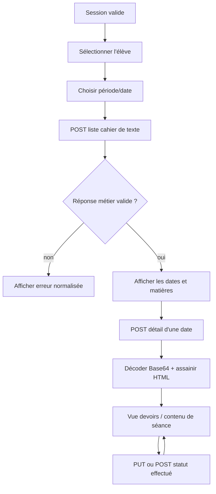
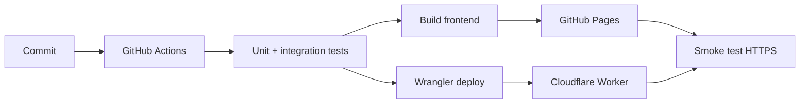

# Plan d'implémentation

## 1. Objectif

Construire l'application ÉcoleDirecte comme une SPA React publiée sur GitHub Pages,
avec un Cloudflare Worker comme façade API. Le Worker résout le problème CORS sans
stocker les identifiants ni les données privées. La première version fonctionnelle
cible la connexion, le MFA/QCM éventuel, le changement de profil enfant, la lecture
du cahier de texte et l'impression/export PDF.

Le dépôt `EduWireApps/ecoledirecte-api-docs` est une documentation communautaire,
non officielle et susceptible d'être incomplète ou obsolète. Chaque endpoint devra
être validé sur un compte de test avant d'être considéré comme un contrat stable.
La documentation consultée signale notamment une évolution du login depuis mars
2025 avec le cookie `GTK`.

## 2. Cible fonctionnelle de la V1

### Inclus

- connexion compte famille ou élève ;
- récupération préalable du cookie GTK ;
- gestion de la réponse métier ÉcoleDirecte, y compris les codes d'erreur renvoyés
  dans un HTTP `200` ;
- parcours de double authentification par QCM si le code `250` est reçu ;
- conservation temporaire de la session et du `X-Token` ;
- affichage des profils enfants disponibles pour un compte famille ;
- liste des devoirs à faire ;
- détail du cahier de texte pour une date ;
- décodage Base64 contrôlé et assainissement du HTML ;
- export par impression navigateur/PDF ;
- relais Cloudflare avec CORS strict, rate limiting et absence de cache privé.

### Hors périmètre initial

- marquage d'un devoir comme effectué/non effectué ;
- notes, vie scolaire, messagerie, cloud et téléchargement de fichiers ;
- notifications push ;
- synchronisation serveur ou base de données utilisateur ;
- renouvellement automatique de token de type mobile ;
- partage de session entre plusieurs appareils ;
- contournement ou automatisation d'un mécanisme MFA.

Ces fonctions peuvent devenir des lots ultérieurs après stabilisation de la V1.

## 3. Architecture cible

### Principes

1. Le navigateur appelle uniquement l'URL publique du Worker.
2. Le Worker n'accepte pas une URL amont fournie dans la requête.
3. Le Worker expose uniquement les routes utilisées et autorisées.
4. Les identifiants, `X-Gtk` et `X-Token` ne sont jamais journalisés, mis en cache
   ou placés dans une URL.
5. Le Worker relaie le format attendu par ÉcoleDirecte : requêtes POST, paramètres
   de route/query et corps `data=<JSON encode>`.
6. Le client traite le contrat métier `{ code, token, data, message, host }` au
   lieu de se fier uniquement au statut HTTP.

## 4. Lots de réalisation

## Lot 0 - Préparer le dépôt et les contrats

### Tâches

- [ ] Créer une arborescence dédiée au Worker, par exemple `worker/`.
- [ ] Ajouter Wrangler et les scripts `worker:dev`, `worker:test` et
      `worker:deploy`.
- [ ] Définir les variables d'environnement : URL amont, origines autorisées,
      version API et environnement.
- [ ] Écrire un contrat interne des routes frontend -> Worker.
- [ ] Ajouter des types de réponse et d'erreur côté client.
- [ ] Vérifier que `docs/ARCHITECTURE.md` et ce plan restent cohérents avec le
      nom de domaine réellement choisi.

### Livrable

Une structure compilable avec un Worker vide, un client API typé et une
configuration locale reproductible.

### Validation

- `npm install`
- `npm run lint`
- `npm run build`
- `wrangler dev` démarre sans secret ni donnée réelle.

## Lot 1 - Relais Cloudflare minimal et sécurisé

### Routes publiques initiales

| Route Worker | Méthode | Amont ÉcoleDirecte | Usage |
| --- | --- | --- | --- |
| `/api/login/gtk` | `GET` | `/v3/login.awp?gtk=1&v=...` | Obtenir le cookie GTK |
| `/api/login` | `POST` | `/v3/login.awp?v=...` | Connexion ou reconnexion |
| `/api/doubleauth` | `GET`, `POST` | `/v3/connexion/doubleauth.awp` | QCM MFA |
| `/api/eleves/:id/cahierdetexte` | `POST` | `/v3/Eleves/:id/cahierdetexte.awp` | Liste des devoirs |
| `/api/eleves/:id/cahierdetexte/:date` | `POST` | `/v3/Eleves/:id/cahierdetexte/:date.awp` | Détail d'une journée |
| `/api/eleves/:id/cahierdetexte/status` | `PUT` | `/v3/Eleves/:id/cahierdetexte.awp` | Marquer un devoir |

Les chemins et verbes devront être confirmés contre les réponses d'un compte de
test. La documentation emploie parfois `GET`/`PUT` comme verbe logique alors que
l'API attend généralement un POST technique ; cette particularité doit être
encapsulée dans le Worker et testée explicitement.

### Tâches

- [ ] Répondre aux préflights `OPTIONS`.
- [ ] Autoriser uniquement les origines connues : production GitHub Pages et
      localhost de développement.
- [ ] Renvoyer `Access-Control-Allow-Origin` avec l'origine exacte et `Vary: Origin`.
- [ ] Autoriser seulement les headers nécessaires : `Content-Type`, `X-Gtk` et
      `X-Token` selon la route.
- [ ] Refuser les méthodes et chemins inconnus avec `405` ou `404`.
- [ ] Relayer `Content-Type`, le body brut et les paramètres nécessaires sans
      parser puis reconstruire inutilement le payload.
- [ ] Ne pas relayer les cookies arbitraires du navigateur vers l'amont.
- [ ] Ajouter un timeout amont et une limite de taille du body.
- [ ] Désactiver tout cache sur les routes privées.
- [ ] Ne pas logger body, mot de passe, `X-Gtk`, `X-Token` ou réponse complète.
- [ ] Ajouter une limite de débit spécifique sur login et double authentification.

### Livrable

Un Worker déployable en environnement de test et capable de relayer un appel
factice sans devenir un open proxy.

### Validation

- test CORS origine autorisée ;
- test CORS origine inconnue ;
- test méthode non autorisée ;
- test route inconnue ;
- test absence de cache ;
- test absence de secret dans les logs ;
- test de taille et timeout ;
- test Worker avec fixtures, sans identifiants réels.

## Lot 2 - Client API et gestion du contrat ÉcoleDirecte

### Tâches

- [ ] Créer un module `src/api/ecoledirecte.js` avec une fonction de requête
      unique.
- [ ] Encoder le body sous la forme `data=${encodeURIComponent(JSON.stringify(body))}`.
- [ ] Générer un `uuid` local uniquement si le mode mobile est réellement retenu.
- [ ] Envoyer un User-Agent cohérent côté Worker ; la documentation indique que
      le User-Agent utilisé pour obtenir un token doit rester identique ensuite.
- [ ] Normaliser les réponses en distinguant : erreur réseau, erreur HTTP et
      erreur métier ÉcoleDirecte.
- [ ] Gérer les codes connus au minimum : identifiants invalides `505`, token
      invalide `520`, token expiré `525`, établissement indisponible `535` et
      JSON invalide `40129`.
- [ ] Prévoir un code inconnu affiché comme erreur générique avec l'identifiant
      de support, sans exposer la réponse brute.
- [ ] Décoder les champs Base64 dans un utilitaire isolé et testable.
- [ ] Assainir tout HTML reçu avant insertion dans le DOM.

### Livrable

Une couche API indépendante de React, testable avec des fixtures et utilisable
par le Worker en développement local ou par l'URL Cloudflare en production.

## Lot 3 - Authentification, GTK et double authentification

### Tâches

- [ ] Ne jamais envoyer le mot de passe dans l'URL.
- [ ] Obtenir `GTK` avant chaque tentative de login selon le contrat actuel.
- [ ] Transmettre `X-Gtk` uniquement au login correspondant.
- [ ] Conserver le contexte MFA uniquement en mémoire jusqu'à la fin du parcours.
- [ ] Décoder les questions et propositions Base64 à l'affichage, mais renvoyer la
      valeur de réponse dans le format attendu par l'API.
- [ ] Rejouer le login avec `fa: [{ cn, cv }]` après résolution du QCM.
- [ ] Ne jamais considérer un HTTP `200` comme un succès sans vérifier `data.code`.
- [ ] Afficher des messages différenciés pour identifiants invalides, MFA requis,
      compte verrouillé/indisponible et token expiré.
- [ ] Effacer le mot de passe dès que la requête de login est terminée.

### Tests d'acceptation

- login réussi sans MFA ;
- identifiants invalides ;
- réponse code `250` ;
- QCM avec plusieurs propositions ;
- réponse QCM incorrecte ;
- login final avec `cn`/`cv` ;
- échec GTK ;
- token absent, expiré ou invalide ;
- réponse HTTP `200` contenant un code métier d'erreur.

## Lot 4 - Session et profils famille/élève

### Tâches

- [ ] Modéliser le compte retourné par login : `id`, `uid`, `typeCompte`,
      `anneeScolaireCourante`, `modules`, `profile` et `classe`.
- [ ] Détecter les comptes famille et la liste des élèves accessibles.
- [ ] Exposer un `SessionContext` React avec état `anonymous`, `authenticating`,
      `mfa-required`, `authenticated` et `expired`.
- [ ] Stocker le token en mémoire par défaut.
- [ ] Rendre la persistance optionnelle dans `sessionStorage`, avec bouton de
      déconnexion qui nettoie immédiatement les données.
- [ ] Ne jamais stocker le mot de passe.
- [ ] Réagir au code `520`/`525` par une invalidation de session et un retour au
      login.
- [ ] Masquer les modules non activés dans l'objet `modules` du compte.

### Livrable

Un parcours complet de connexion et de sélection du profil actif, sans encore
charger le cahier de texte.

## Lot 5 - Cahier de texte

### Endpoints à implémenter

1. `GET /v3/Eleves/{id}/cahierdetexte.awp` pour la liste des devoirs à venir.
2. `GET /v3/Eleves/{id}/cahierdetexte/{AAAA-MM-JJ}.awp` pour le détail quotidien.
3. `PUT /v3/Eleves/{id}/cahierdetexte.awp` pour les listes
   `idDevoirsEffectues` et `idDevoirsNonEffectues`.
4. Optionnel après V1 : `POST /v3/eleves/{id}/afaire/commentaires.awp`.

### Tâches

- [ ] Valider le nommage exact `Eleves`/`eleves` auprès de l'API réelle ; les
      exemples de la documentation ne sont pas toujours homogènes.
- [ ] Transformer la réponse indexée par date en modèle UI stable.
- [ ] Charger les détails à la demande pour limiter le trafic.
- [ ] Afficher état vide, chargement, erreur, hors ligne et session expirée.
- [ ] Décoder `contenu` et `message` Base64 avec gestion des données invalides.
- [ ] Assainir le HTML autorisé en supprimant scripts, handlers et URLs dangereuses.
- [ ] Rendre le marquage idempotent côté interface et recharger en cas d'échec.
- [ ] Ne pas mettre les réponses privées dans un cache global ou service worker.

### Critères d'acceptation

- l'utilisateur voit les devoirs groupés par date ;
- le détail d'une journée affiche matières, professeur, devoir et contenu de séance ;
- une erreur de décodage n'empêche pas l'affichage du reste de la journée ;
- le statut effectué/non effectué est synchronisé après confirmation de l'API ;
- un token expiré renvoie proprement vers la connexion.

## Lot 6 - Interface, impression et PWA

### Tâches

- [ ] Remplacer le scaffold Vite par les vues login, MFA, sélection élève,
      cahier de texte et session expirée.
- [ ] Ajouter une navigation utilisable au clavier et des labels accessibles.
- [ ] Prévoir le responsive mobile, notamment pour le QCM et les listes de devoirs.
- [ ] Ajouter `@media print` pour masquer navigation, filtres et actions.
- [ ] Conserver une mise en page A4 lisible avec `break-inside: avoid`.
- [ ] Ajouter le manifeste et le service worker uniquement après validation du
      comportement de session.
- [ ] Ne pas précacher de données API privées dans la PWA.

### Validation UX

- parcours clavier complet ;
- contraste et messages d'erreur compréhensibles ;
- affichage mobile et desktop ;
- impression PDF avec contenu multi-pages ;
- rechargement de la page avec session mémoire expirée ;
- déconnexion depuis chaque vue authentifiée.

## Lot 7 - Tests, qualité et déploiement

### Tests automatisés

- [ ] Tests unitaires de l'encodage `data` et du décodage Base64.
- [ ] Tests unitaires de normalisation des codes métier.
- [ ] Tests du client API avec `fetch` mocké.
- [ ] Tests du Worker pour CORS, routage, headers, timeout et absence de logs sensibles.
- [ ] Tests React du login, MFA, sélection d'élève, devoirs et expiration de token.
- [ ] Tests de build et lint dans CI.
- [ ] Tests end-to-end contre un Worker mocké, jamais contre un compte réel en CI.

### Déploiement

- [ ] Définir les environnements `dev`, `staging` et `production`.
- [ ] Configurer l'URL Worker du frontend via une variable Vite de build.
- [ ] Définir les origines CORS par environnement.
- [ ] Déployer le Worker avant le frontend qui l'utilise.
- [ ] Vérifier le domaine GitHub Pages réel et le chemin de base Vite.
- [ ] Exécuter un smoke test sans identifiants réels : preflight, route inconnue,
      erreur d'authentification simulée et réponse de santé non sensible.
- [ ] Documenter la procédure de rollback Worker et frontend.

## 5. Ordre recommandé et jalons

| Jalon | Lots | Résultat |
| --- | --- | --- |
| M0 | 0 | Contrats et outillage prêts |
| M1 | 1-2 | Worker et client API testables avec fixtures |
| M2 | 3 | Login et MFA fonctionnels |
| M3 | 4 | Session et profils famille/élève |
| M4 | 5 | Cahier de texte consultable et statuts synchronisés |
| M5 | 6 | Interface accessible, responsive et imprimable |
| M6 | 7 | CI, déploiement et smoke tests |

L'implémentation doit s'arrêter à chaque jalon pour valider le contrat avec un
compte de test. Il faut éviter de développer plusieurs modules ÉcoleDirecte en
parallèle avant d'avoir stabilisé le login, car toutes les routes authentifiées
dépendent de la gestion correcte du `X-Token`, du `X-Gtk` et des codes métier.

## 6. Risques et décisions à prendre

| Risque | Impact | Réduction |
| --- | --- | --- |
| Documentation communautaire obsolète | Login ou routes incompatibles | Fixtures versionnées + tests manuels de contrat |
| API répondant HTTP `200` sur une erreur | Faux succès côté UI | Toujours inspecter le code métier |
| Cookie GTK requis | Tous les logins échouent | Implémenter le pré-login GTK dans le Worker |
| QCM/MFA variable selon le compte | Parcours non linéaire | Machine d'état dédiée et tests de chaque branche |
| HTML/Base64 non fiable | XSS ou affichage cassé | Décodage tolérant + sanitizer strict |
| Worker public abusé | Coût ou indisponibilité | Allowlist routes, CORS, rate limit, quotas et alertes |
| Token stocké côté navigateur | Vol en cas de XSS | CSP, sanitizer, mémoire par défaut, sessionStorage optionnel |
| Changement du contrat API | Régression production | Smoke test et surveillance des codes inconnus |

## 7. Première tranche à implémenter

La première itération de code doit rester volontairement courte :

1. créer le Worker et ses tests CORS/routage ;
2. implémenter `GET /login.awp?gtk=1` avec relais du cookie GTK ;
3. implémenter le login POST avec payload `data`, `X-Gtk` et lecture du code métier ;
4. créer le client API React et une page de login minimale ;
5. ajouter des fixtures pour succès, erreur `505` et MFA `250` ;
6. faire passer lint, build et tests avant d'ajouter les profils ou le cahier de texte.

Cette tranche fournit le premier risque technique discriminant : prouver que le
couple navigateur -> Worker -> API ÉcoleDirecte fonctionne avec le protocole GTK,
les headers CORS et le format de réponse réel.

## Références

- [ecoledirecte-api-docs](https://github.com/EduWireApps/ecoledirecte-api-docs)
- [Architecture d'infrastructure du projet](./ARCHITECTURE.md)
- [Vite](https://vite.dev/)
- [Cloudflare Workers](https://developers.cloudflare.com/workers/)
